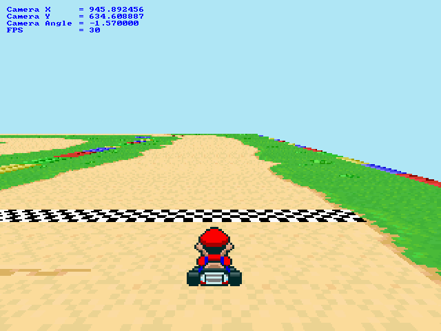

Mario Kart Clone
================



In late 2008 I created this Mario Kart Clone using C++ and Allegro Library
when I was a student of Computer Science at Catholic University of Pelotas (UCPEL)

This project has been migrated from Allegro 4 to SDL2 using a lightweight compatibility shim.

* Tested on Ubuntu 19.10

Game features
-------------

* Player movement
* Fake 3D using the Super Mode 7 algorithm

# Dependencies

* SDL2
* SDL2_ttf
* cmake
* gcc/g++

```shell
sudo apt install libsdl2-dev libsdl2-ttf-dev
```

# Build

The project uses SDL2 and SDL2_ttf libraries. A compatibility layer (`src/common/allegro.h` and `src/common/allegro.cpp`) provides the Allegro 4 API on top of SDL2, allowing the game code to remain mostly unchanged.

# Run

Game

```shell
make run-game
```

Track Editor

```shell
make run-editor
```
